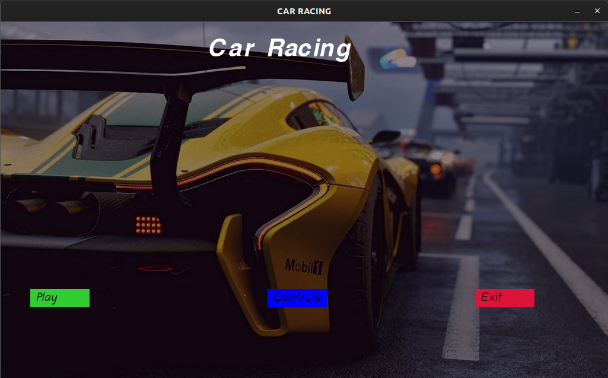
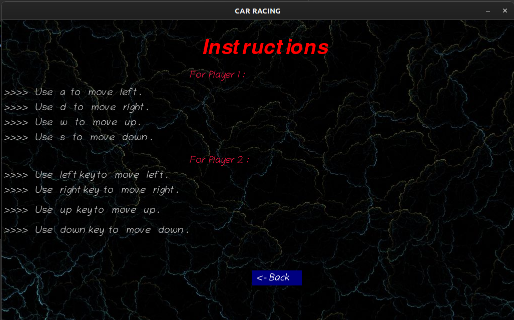

# Car Racing 2

<p>It is basic Car Racing Game made in Python using Pygame,
You can play it in any OS .</p>

# Dependencies
* These must be installed in your PC/Laptop
    * Python 
    * Pygame

**In windows**

* You can download python from here [Python](https://www.python.org/downloads/ "https://www.python.org/downloads/")

```
pip install pygame
```
**In Mac**

* You can download python from here [Python](https://www.python.org/downloads/ "https://www.python.org/downloads/")

```
pip3 install pygame
```

**In Linux**

```
sudo apt install python3
```
```
pip3 install pygame
```
# Images




# How to Play
* Just open the __CMD__ in _Windows_ and __Terminal__ in _Mac / Linux_

**In Windows**
```
python main.py
```
**In Mac / Linux**
```
python3 main.py
```

# Note 
> Please do not delete any image/file .

> Hope you will enjoy the game ;))
